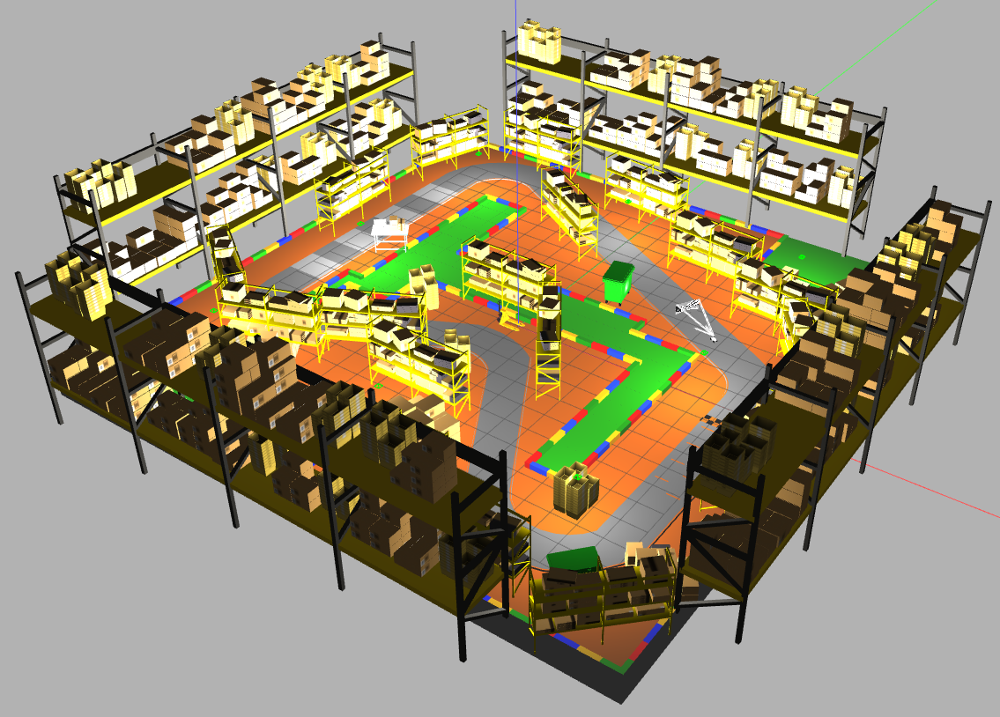

<!-- # Lane_Detection_with_Control_Steering -->
# Visual Odometry from Scratch

**Author**: Natthaphat Soookpanya (65340500023)  
**Framework**: ROS 2 + Gazebo + OpenCV (Python)

## 🛠️ Install My Project

### Dependencies
- Install ROS 2 humble, please refer to [ROS 2 installation](https://docs.ros.org/en/humble/Installation.html) to get started.
- Install Gazebo, Rviz, for ROS 2 Humble.
- Install `cv-bridge`, `opencv`, `numpy`, `yaml`, `matplotlib`
    ```bash
    sudo apt install ros-humble-cv-bridge ros-humble-image-transport ros-humble-message-filters
    pip install opencv-python numpy pyyaml matplotlib cv-bridge
    ```
### Package
- Clone my workspace
    ```bash
    cd
    git clone https://github.com/G4CiO/Visual_Odometry_from_Scratch.git
    cd Visual_Odometry_from_Scratch
    colcon build && source install/setup.bash
    ```
- add source this package in .bashrc file.
  ```bash
  echo "source ~/Visual_Odometry_from_Scratch/install/setup.bash" >> ~/.bashrc
  ```
  - source this package for sure.
  ```bash
  source ~/.bashrc
  ```
## ⚙️ How to run code

1. Launch [rover_bringup.launch.py](src/rover_bringup/launch/rover_bringup.launch.py) for set environment from LAB 1 (gazebo), open RviZ, spawn robot, run controller for control robot.
    ```bash
    ros2 launch rover_bringup rover_bringup.launch.py
    ```

2. Run node [visual_odom_orb_bf.py](src/rover_visual_odom/scripts/visual_odom_orb_bf.py) for create visual odometry and see it in Rviz.
    ```bash
    ros2 run rover_visual_odom visual_odom_orb_bf.py
    ```

3. Run node [controller_server.py](src/rover_controller/scripts/controller_server.py) to make the robot tracking the path from LAB 1, then compare odometry from visual odometry and ground truth.
    ```bash
    ros2 run rover_controller controller_server.py
    ```

---

## 📌 Project Description

This project aims to develop a **Visual Odometry (VO)** system from scratch using **stereo cameras** on a mobile robot in a **real-time** simulation environment. The main goal is to implement VO using Python and OpenCV within a **ROS 2** and **Gazebo** simulation.

Key concepts involved:
- Transformation Matrix
- Stereo Depth Calculation
- Feature Detection & Matching (SIFT or ORB)

---

## 🎯 Objectives

1. Develop and study VO using Python and OpenCV from stereo camera input.
2. Deploy and test VO in a simulated mobile robot within Gazebo.
3. Use ROS 2 as the core framework for robot-camera-processing communication.
4. Ensure the VO system runs in **real-time** with stereo camera input.

---

## ✅ Requirements

### Functional Requirements

- **Stereo Camera Simulation in Gazebo**
  - Simulate left-right stereo cameras on a mobile robot.
  - Publish camera feeds to ROS topics.

- **Image Acquisition in ROS**
  - Subscribe to stereo image topics via ROS 2.
  - Use `cv_bridge` to convert ROS images for OpenCV use.

- **Visual Odometry Processing**
  - Detect and match features (e.g., ORB or SIFT).
  - Calculate Essential Matrix and Pose (Rotation, Translation).
  - Estimate robot position frame-to-frame.

- **Visualization**
  - Display robot trajectory in real-time (e.g., RViz or Matplotlib).
  - Compare VO trajectory to ground truth from Gazebo.

- **ROS Integration**
  - VO node must work within the ROS 2 ecosystem and interfaces.

### Performance Requirements

- VO processing rate: **≥ 10–15 Hz**.
- VO trajectory error: **≤ 10–15%** compared to ground truth.

---

## 🔍 Scope

1. Simulate a mobile robot with stereo camera in Gazebo.
2. Capture stereo image data using ROS 2 `image_raw` topics.
3. Compute VO using OpenCV:
   - Feature Detection & Matching
   - Essential Matrix Estimation
   - Pose Estimation (R, T)
   - Frame-to-frame motion tracking
4. Compare VO path with Gazebo's ground truth.

---

## 🧠 System Architecture


### 1. Camera Input from Gazebo
Uses the `libgazebo_ros_camera.so` plugin to simulate camera input in Gazebo. ROS image messages are converted to OpenCV format for processing.

### 2. Stereo to Depth Calculation

Uses disparity between left and right images to compute depth:

```math
Z = \frac{f * b}{x_L - x_R}
```

Where:
- $Z=$ depth
- $f=$ focal length
- $b=$ baseline (distance between cameras)
- $x_L,x_R=$ pixel coordinates from left and right images (disparity)

### 3. Feature Detection & Matching

#### Steps:
- **Feature Extraction**: Extract keypoints and descriptors from current and next left frames.
- **Feature Matching**: Match descriptors using a matcher (e.g., BFMatcher).
- **Match Filtering**: Filter poor matches using distance threshold.

### 4. Motion Estimation
Estimate robot motion (Odometry) using matched keypoints and depth information from stereo images.

## 🧑‍💻 Implementation

### 1. Set Environment
- Use environment from LAB 1 and object from aws robomaker warehouse.
  
### 2. Set Robot
- Use robot from LAB 1 but i will add left and right camera later 
### 3. Set Camera
- I setting left & right camera sensor in [left_camera.xacro](src/rover_description/urdf/left_camera.xacro) and [right_camera.xacro](src/rover_description/urdf/right_camera.xacro) for use in  gazebo.
- It has the following important settings:
  ```html
  <gazebo reference="left_camera_link">
      <material>Gazebo/Green</material>
      <sensor name="camera" type="camera">
          <pose> 0 0 0 0 0 0 </pose>
          <visualize>false</visualize>
          <update_rate>100</update_rate>
          <camera>
              <horizontal_fov>1.089</horizontal_fov>
              <image>
                  <format>L8</format>
                  <width>1384</width>
                  <height>1032</height>
              </image>
              <clip>
                  <near>0.02</near>
                  <far>300</far>
              </clip>
          </camera>
          <plugin name="left_camera_controller" filename="libgazebo_ros_camera.so">
              <ros>
                  <namespace>camera</namespace>
                  <remapping>left_camera_link/image_raw:=left_image</remapping>
                  <remapping>left_camera_link/camera_info:=left_info</remapping>
              </ros>
              <camera_name>left_camera_link</camera_name>
              <frame_name>left_link</frame_name>
          </plugin>
      </sensor>
  </gazebo>
  ```
  `<camera>`
  Defines camera-specific parameters:

  - `<horizontal_fov>1.089</horizontal_fov>`
    - Purpose: Horizontal field of view in radians (~62.4°).

    - Affects how wide the camera sees.

  - `<image>`
    - Defines the camera image settings:

    - `<format>L8</format>`: Image format. L8 = 8-bit grayscale (1 channel).

    - `<width>1384</width>`: Image width in pixels.

    - `<height>1032</height>`: Image height in pixels.

  View of camera im gazebo:
   

### 4. Setup Stereo Image Synchronization
```python
left_img_sub = Subscriber(self, Image, '/camera/left_image')
right_img_sub = Subscriber(self, Image, '/camera/right_image')
self.stereo_sync = ApproximateTimeSynchronizer([left_img_sub, right_img_sub], 10, 0.01)
```
Ensures both stereo images arrive close in time.

### 5. Convert and Preprocess Images
```python
left_img = self.bridge.imgmsg_to_cv2(left_msg, "bgr8")
left_gray = cv2.cvtColor(left_img, cv2.COLOR_BGR2GRAY)
```
Converts ROS image to grayscale OpenCV format.

### 6. Depth Map from Stereo
```python
disparity = stereo_matcher.compute(left_gray, right_gray)
depth_map = (fx * baseline) / disparity
```
Uses `cv2.StereoSGBM_create()` to compute disparity, then calculates depth.

- Original image

https://github.com/user-attachments/assets/46e18cd2-fd3a-43d5-bb82-12dc8ecda57c

- Disparity

https://github.com/user-attachments/assets/3bc7f8f7-2f56-437f-83c5-5fb8f1843ca2

- Depth

https://github.com/user-attachments/assets/ec9abf0f-2c86-4003-81cc-ecfdf70b6e8e

**SGBM(Semi-Global Matching)** is based on **BM (Block Matching)**.
- **BM** divides the image into small blocks and compares the similarity of the blocks from the left and right images. Then, it calculates the disparity (distance between matching pixel positions) by looking at how much the block from the left image must be “shifted” to match the right image.

- **SGBM** is similar to BM, but it calculates the error value based on the difference values ​​of the surrounding blocks in several directions (e.g. left-right, up-down, diagonal, total of 8 directions). It “smooths” the difference values ​​to obtain a continuous and smooth disparity map.


### 7. ORB Feature Detection & Matching
```python
kp1, des1 = orb.detectAndCompute(prev_img, mask)
kp2, des2 = orb.detectAndCompute(curr_img, mask)
matches = bf_matcher.knnMatch(des1, des2, k=2)
```
Uses ORB + BruteForce to finds the 2 nearest neighbors for each descriptor.

https://github.com/user-attachments/assets/68267561-2ffd-40e2-af03-0abd4c5bde8d

**ORB (Oriented FAST and Rotated BRIEF)**

Use it to find keypoints in an image to compare two images. ORB is designed to be faster, lighter, and more suitable for real-time systems such as robots.

1. Find Keypoints with **FAST (Features from Accelerated Segment Test)**
    
    - Consider a pixel compared to 16 surrounding pixels (a circle with radius = 3)
    - If surrounding pixels have a significant difference in brightness from the center by at least 12 points → it is considered a “corner” or keypoint
    - However, FAST has no direction information and has scaling issues because the circle radius is set to 3 only.
2. Finding Scale and Rotation of an Image
    
    - The bottom of the pyramid is the original image. For each layer above, the image is scaled by a constant ratio to provide images with different resolutions.
    - In a feature matching algorithm, we can match images on different layers to achieve scale constancy.
    - For example, if the camera moves backward, we should find the matching image in the previous upper layer and the next lower layer.
3. Create Descriptor with **BRIEF (Binary Robust Independent Elementary Features)**
    - Randomly select two pixels (p,q) around the keypoint and see if pixel p > q.
    - If p is greater than q, use 1, otherwise use 0.
    - Store the result as binary (0 or 1).
    - Get a descriptor of 256 bits.
  
  **BF Matcher (Brute-Force Matcher)**

- Take the descriptor from the first image and compare it with every descriptor in the second image, every pair, to find the most similar pair.
- How it works
  - Take the descriptor from image 1 (e.g. point 1) and compare it with the descriptor of every point in image 2.
  - Calculate the “distance” (Distance) such as:
    - Euclidean distance → Use with SIFT (float values)
    - Hamming distance → Use with ORB (binary values) This is to find the number of bits that are different between 2 binary strings.
  - Choose the pair with the least distance as the best match.


### 8. Lowe's Ratio Test
After extracting ORB features and descriptors, we use a BruteForce matcher to match keypoints between two frames. To eliminate ambiguous matches, we apply Lowe’s ratio test.
```python
good_matches = []
for match_pair in matches:
    if len(match_pair) == 2:
        m, n = match_pair
        if m.distance < self.lowe_ratio * n.distance:
            good_matches.append(m)
matches = good_matches
```
Lowe’s ratio test helps filter out poor matches by comparing the distance of the best match to the second-best match:
```math
\frac{distance(m)}{distance(n)} < loweratio
```
If the closest match is significantly better (i.e., much smaller distance) than the second-closest, it’s likely to be a good match.


### 9. Get 3D Points from Depth Map
Before estimating motion using PnP, we must convert 2D image keypoints (from the previous frame) to 3D coordinates using the depth map:
```python
fx = camera_params['fx']
fy = camera_params['fy']
cx = camera_params['cx']
cy = camera_params['cy']
```
Use the **pinhole camera model:**


```math
X = \frac{Z(u-c_x)}{f_x},
Y = \frac{Z(v-c_y)}{f_y},
Z = depthmap[v,u]
```

Where:
- $u=$ Pixel x-coordinate (horizontal) of the keypoint in the image
- $v=$ 	Pixel y-coordinate (vertical) of the keypoint in the image
- $c_x=$ Principal point x-coordinate, from the camera intrinsic matrix (K)
- $c_y=$ Principal point y-coordinate, from the camera intrinsic matrix (K)
- $f_x=$ Focal length in the x-direction (in pixels), from the intrinsic matrix
- $f_y=$ 	Focal length in the y-direction (in pixels), from the intrinsic matrix
- $Z=$ 	Depth value at pixel (u, v), retrieved from the depth map
- $X,Y=$ Reconstructed 3D point coordinates in the camera coordinate frame

**Camera Intrinsic Matrix (K):**

The matrix K (from `/camera/left_info`) looks like:

$$
\mathbf{K} = 
\begin{bmatrix}
f_x & 0 & c_x 
\\ 0 & f_y & c_y
\\ 0 & 0 & 1
\end{bmatrix}
$$

### 10. Motion Estimation (PnP + RANSAC)
```python
success, rvec, tvec, inliers = cv2.solvePnPRansac(object_points, image_points, K, None)
R, _ = cv2.Rodrigues(rvec)
```
Estimates camera motion between frames using matched keypoints with known 3D depth.

- PnP stands for Perspective-n-Point, it is used to calculate “where the camera is and where it is facing” by knowing 3D points in the real world and 2D points in the image.
- Example data used:
  - 3D points from depth calculation such as (X, Y, Z) → found using Pinhole Model formula
  - 2D points in the image → pixel coordinates of the matching keypoints (such as (u, v))
- Highlights of RANSAC:
  - Good noise suppression → No mismatches (outliers)
  - Stable even with some data errors

### 11. Pose Accumulation and Odometry Publishing

Visual Odometry (VO) calculates the **camera's motion**, but in robotics applications we typically track the **robot's motion** (`base_link` or `base_footprint`). Since the camera is mounted on the robot, we must convert the estimated pose from the **camera coordinate frame** to the **robot coordinate frame**.

---

**Coordinate Frame Differences**

| Coordinate Frame | X-axis   | Y-axis   | Z-axis   |
|------------------|----------|----------|----------|
| **Camera**       | Right    | Down     | Forward  |
| **Robot (ROS)**  | Forward  | Left     | Up       |

To convert:

- `x_robot = -z_camera`
- `y_robot = -x_camera`
- `z_robot = -y_camera`

---

**Rotation Matrix Conversion**

Use the following matrix to convert rotation from camera to robot frame:

```python
R_cam_to_robot = np.array([
    [0,  0, -1],
    [-1, 0,  0],
    [0, -1,  0]
])
```
Apply it like this.
```python
R_robot = R_cam_to_robot @ R_cam @ R_cam_to_robot.T
```

**Position Vector Conversion**

To convert the position vector:
```python
position_robot = np.array([
    -position_camera[2],  # z -> -x
    -position_camera[0],  # x -> -y
    -position_camera[1]   # y -> -z
])
```

**Final Transformation Matrix**
The transformed rotation and position are assembled into a 4×4 pose matrix:
```python
T_robot[:3, :3] = R_robot
T_robot[:3, 3] = position_robot
```
This corrected pose can now be safely used to publish `/odometry/visual_odom`.

```python
odom_msg.pose.pose.position.x = position[0]
odom_msg.pose.pose.orientation = Quaternion(x, y, z, w)
```
Publishes robot's pose based on estimated motion and compare with ground truth in Rviz.


## 📊 Result

### Lowe's Ratio: 0.3


### Lowe's Ratio: 0.5


### Lowe's Ratio: 0.7


**Table of RMSE Analysis Results**
| Lowe's Ratio | RMSE (meters)   | Max error (meters)| Min error (meters)| Percentage error (RMSE/mean_dist) |
|--------------|-----------------|-------------------|-------------------|-----------------------------------|
| **0.3**      | 0.4521          | 0.7203            | 0.0132            | 5.13%                             |
| **0.5**      | 1.2145          | 2.2523            | 0.0320            | 13.75%                            |
| **0.7**      | 1.2340          | 2.2903            | 0.0046            | 14.00%                            |

### Update rate of camera
My camera sensor has update rate around 12 hz when run full system.


## 🏁 Conclusion

1. Resolution affects the update rate of motion estimation, higher resolution will be more accurate estimate but lower update rate.
2. Gray scale has higher update rate than RGB.
3. Lower distance ratio will be more accurate.